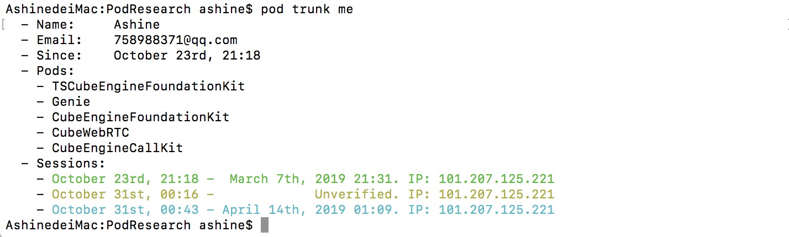
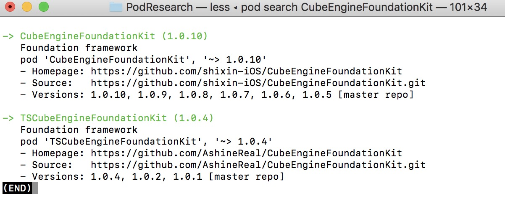

# CocoaPods


[CocoaPods](https://cocoapods.org) is a dependency manager for Swift and Objective-C Cocoa projects. It has over 55 thousand libraries and is used in over 3 million apps. CocoaPods can help you scale your projects elegantly.


Define once, update easily
Create a Podfile describing the code you'd like to pull in. Run pod install and get the same versions as everyone else in your team.

CocoaPods makes updating a single dependency easy via pod update FLKAutoLayout or updating all of them with just pod update.

You can use your code or Open Source.


##### 它的工作原理就是在GitHub上面有个Spec Repo，它里面包括成千上万的podspec文件索引目录。然后我们在项目集成的时候可以通过它去找到我们需要的开源代码。其实CocoaPods的Spec Repo就是一个中介


# Podfile


#### CubeWare中的podfile

```
target 'CubeEngineDemo' do
	project 'CubeEngineDemo/CubeEngineDemo.xcodeproj'
	pod 'Masonry'
	pod 'M80AttributedLabel'
	pod 'SDWebImage'
	pod 'SDWebImage/GIF'
	pod 'TTTAttributedLabel'
	pod 'AFNetworking'
	pod 'WCDB'
	pod 'CubeEngineFoundationKit' , '1.0.10'
	pod 'CubeEngineCallKit' , '1.0.8'
	pod 'UMCCommon'
	pod 'UMCAnalytics'
	pod 'UMCSecurityPlugins'
end

```


# Spec文件

##### 1.创建Spec文件
```
//切换到项目根目录
cd ~/xxx

//创建spec文件 
pod spec create xxx
```


##### 2.Spec文件结构

```
Pod::Spec.new do |spec|

spec.name                  = 'xxx'

spec.version               = '1.0.2'

spec.ios.deployment_target = '8.0'

spec.license               = 'MIT'

spec.homepage              = 'https://github.com/xxxx'

spec.author                = { "xxxx" => "xxxxxxxx@qq.com" }

spec.summary               = 'spec项目描述'

spec.source                = { :git => 'https://github.com/xxx/xxxxxx.git', :tag => spec.version }

spec.source_files          = "xxxx/**/{*.h,*.m}"

spec.resources             = "xxxxx/source.bundle"

spec.frameworks            = 'UIKit'

spec.library               = 'z'

spec.requires_arc          = true

spec.dependency            = 'xxxx'

end
```


### 如下是引擎foundationKit的CubeEngineFoundationKit.podspec文件结构


##### 3.验证Spec文件
```
pod spec lint xxxx.podspec
```
这一步如果报错,根据错误自行修改,根据大致意思能看出来个大概,终端会给出哪一行出错了.一般就是语法错误,资源找不到,git地址不对或者不能访问.指定的文件如{.h,.m}找不到,一般再检查检查基本没问题.

#### 其它 
<b> pod lib lint </b> 和 <b> pod spec lint </b>有什么区别

pod lib lint 不需要联网,属于本地验证
pod spec lint 会联网检查sepc repo,并且关联tag进行检查


# Pod Trunk 
##### 注册trunk,并提交spec文件cocoapods仓库

注册chunk,查看是否注册过

```
pod trunk me
```

如果没有注册,那么注册:

```
pod trunk register 592263286@qq.com "Ashine"
```

填上邮箱 和 用户名就可以了.注册完成之后会给你的邮箱发个邮件,进入邮箱邮件里面有个链接,需要点击确认一下.然后再查看下是否注册成功:


#### 如下是我的Pod注册信息


提交spec文件到 CocoaPods 中心仓库

```
pod trunk push xxx.podspec 
```

如果前面都没问题,这一步基本也没啥问题.不过网速比较慢可能要等很久,这一步建议翻墙,不然有可能真的很慢.

然后验证一下,是否可以查到

```
pod search xxx
```

#### 如下使用`pod search CubeEngineFoundationKit`的结果



如果pod search 不成功

```
rm ~/Library/Caches/CocoaPods/search_index.json 
```
这句话是移除已经生成的搜索目录缓存文件,移除之后,执行pod search会重新生成一份最新的缓存列表,基本到这里就差不多了.

#### 其它
多人共同维护你的开源项目
如果需要多个人维护一个库,每个人都应该有权限push提交spec文件;第一个push的人可以被认为是管理员,可以再添加子管理员,这样子管理员就有权限push了

添加spec管理员

```
pod trunk add-owner 邮箱地址
```
移除spec管理员

```
pod trunk remove-owner 邮箱地址
```


# Pod创建私有库
##### The Specs Repo is the repository on GitHub that contains the list of all available pods. Every library has an individual folder, which contains sub folders of the available versions of that pod.

##### 将CocoaPods的Spec Repo source源换成我们私有库的源,让cocoaPod查找我们的私有库

#### 1.创建私有 Spec Repo

按照上面的理解，我们如果能自己创建一个类似CocoaPods的Spec Repo，然后把我们公共组件的podspec文件放在里面，然后集成的时候让CocoaPods帮我们集成那我们就能达到目的。

`1、进入./cocoapods/repos 查看已经存在的spec repo，这个时候我们能看到一个master文件夹。`

`2、在私有git服务器上创建自己的spec repo，`

```
$ pod repo add '私有库名:如Ashine' '私有git源'
```

`3、使用第1步中的命令进入目录我们发现多了一个Ashine文件夹，到这里我们的私有spec repo就创建好了。`


#### 2.私有库需要指定source源,公有库不需指定源

```
pod spec lint --sources='http://code.workinggo.com/guoqiang/SXSpecs.git'
```

#### 3.如下是司派IM的podfile文件

```
#use_frameworks!
source 'https://github.com/CocoaPods/Specs.git' #共有库
source 'http://code.workinggo.com/guoqiang/SXSpecs.git' #私有库 (也是指定了source私有源)

platform :ios, '9.0'

target 'SPIM_Example' do
	pod 'SPIM', :path => '../'
  target 'SPIM_Tests' do
    inherit! :search_paths

  end
end
```

# References

[Pod官网详解](https://guides.cocoapods.org)

[cocoapods系列教程](https://www.jianshu.com/p/1f70f1176727)

[使用CocoaPods创建私有Spec Repo管理项目公共组件](http://www.cocoachina.com/ios/20170728/20046.html)

[iOS创建开源库步骤,提交cocoa pods官网，别人可以使用](https://www.cnblogs.com/bboymars/p/5382012.html)

[CocoaPod代码库创建，配置Spec踩过的坑](https://blog.csdn.net/xiaofei125145/article/details/50673392)

[CocoaPods 详解之——更新篇 trunk 详解](https://blog.csdn.net/twtydgo/article/details/51263078)